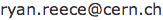

Getting started
===============================================================================

<!-- PAGETOC -->

Checking-out the template
-------------------------------------------------------------------------------

Check out `markdown-memo` with a [simple git command](http://rogerdudler.github.io/git-guide/),
like:

    git clone https://github.com/rreece/markdown-memo.git

Some basic instructions are given in the [README.md](https://github.com/rreece/markdown-memo/blob/master/README.md).
They are expanded on here.

Basically, once you have cloned `markdown-memo`, if you satisfy its requirements
you should be able to call `make` and receive reasonable html output,
and call `make pdf` and receive a reasonable pdf.

Feel free to rename `markdown-memo` as whatever is suitable to your project,
and delete the example `*.md` files.

Requirements
-------------------------------------------------------------------------------

-   make
-   LaTeX (texlive)
-   cabal
-   pandoc
-   python

On my Mac laptop (OS X, 10.8), I installed any missing dependencies through
[macports](https://www.macports.org/).
You can probably use [Fink](http://www.finkproject.org/),
or [Homebrew](http://brew.sh/),
or whatever, instead if you like.

After installing [macports](https://www.macports.org/) or whatever,
maybe you need to do something like the following to install
missing dependencies.

    sudo port selfupdate
    sudo port install python27
    sudo port select python python27
    sudo port install py27-matplotlib
    sudo port install texlive-latex texlive-latex-recommended texlive-latex-extra texlive-math-extra
    sudo port install hs-cabal-install
    sudo port install pandoc

I've also had to install `pandoc-crossref`, and I think I had to install `pandoc-citeproc`.
In the case of [pandoc-crossref](https://github.com/lierdakil/pandoc-crossref), you simply
do this to install:

    cabal update
    cabal install pandoc-crossref

If something doesn't work for you, please let me know!
I'll do my best improve the documentation and make
the software more robust as time allows.
Contact me at:

Please let me know if you have success or failure testing
this on different systems.

Starting a page or section
-------------------------------------------------------------------------------

Just open or create a first `md` file in that directory like `01-introduction.md`,
and start typing.
Each file should probably correspond to a webpage or section in the document,
and in that case, it should begin with an `h1`-level heading (section), denoted with
a double-rule of equal-signs, like:

    Section title
    ===============================================================================

Or marked like this:

    # Section title

Then you can have sub-sections as you wish, and/or just start typing the main text.
There's no need for additional markup or html.

You can delete the example `*.md` files within this template
when beginning your project.

Going from there
-------------------------------------------------------------------------------

The following sections of this example document will show examples of
Markdown syntax. For now, briefly, some examples of
[Markdown syntax](http://daringfireball.net/projects/markdown/syntax)
are

    Section 1
    =================================

    Sub-section 1
    ---------------------------------

    [Lorem ipsum](https://en.wikipedia.org/wiki/Lorem_ipsum)
    dolor sit amet, duo ut putant verear, nam ut brute utroque.
    Officiis qualisque conceptam te duo, eu vim soluta numquam, has ut aliquip
    accusamus. Probo aliquam pri id. Mutat singulis ad vis, eam euismod pertinax
    an, ea tale volumus vel. At porro soleat est. Debet facilis admodum an sed,
    at falli feugiat est.

    1.  one
    1.  two
    1.  three

    You can do latex in-line, $e^{i\pi} + 1 = 0$, like that.
    Or equations:

    \begin{equation}
        \int_{\partial\Omega} \omega = \int_{\Omega} \mathrm{d}\omega \,.
    \end{equation}

Building your document
-------------------------------------------------------------------------------

In addition to writing the basic `md` files for your project, you need to write
a metadata file: `meta.yaml`.  See the example metadata there.

Then you can build your document.
A lot of the inner-workings of `markdown-memo` are done in the `Makefile`.

-   Call `make` or `make html` to generate valid xhtml. For example, [this document](http://rreece.github.io/sw/markdown-memo/).
-   Call `make pdf` to generate a pdf document. For example, [this document](http://rreece.github.io/sw/markdown-memo/example.pdf).
-   Call `make clean` to delete temporary LaTeX files.
-   Call `make realclean` to additionally delete the output html and pdf files.

I use an image of my email to hide it from text crawlers.
Please replace `img/my_email.png` with a screenshot of your
email address instead of mine,
or just remove the use of the image in `meta.yaml`.

Customize the files in `templates/` to adjust the format
of the output html and pdfs files to your needs.

