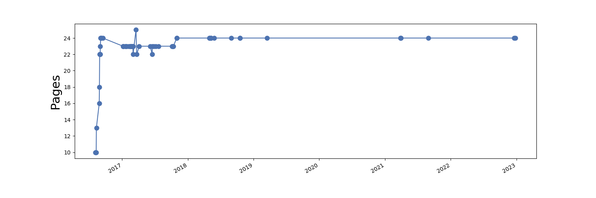

\appendix

Special features
===============================================================================

This is an appendix.
You start it like any other section, except put the following command first, before the section heading.

    \appendix

    Put appendix name here
    ===============================================================================

If you add multiple appendices, perhaps you want to separate them from the main text with a part:

    \clearpage
    \appendix
    \part*{Appendices}
    \addcontentsline{toc}{part}{Appendices}
    
    Example appendix
    ===============================================================================
    
    Start writing the appendix...

Special files
-------------------------------------------------------------------------------

There are a few special files that help steer the execution of markdown-memo
or are otherwise exceptional.

Documentation:

-   `README.md` - Please empty this file and adapt it to your project.
-   `VERSIONS.md` - Documents the chronology of markdown-memo versions.  Feel free to delete or adapt this to your project.

Primary files edited by the user:

-   `meta.yaml` - The main metadata file controlling the project in many ways.
-   `*.md` - Any other user-created Markdown files, the markup of your document.

Optional files:

-   `index.[md,txt]` - The top-level, root file of your project. By default, if `index.txt` is missing,
    a table of contents is generated for `index.md`, otherwise (the user-written) `index.txt`
    is copied to be the `index.md`. *You should not write* `index.md`.
-   `bib_index.md` - Call `make bib_index.md` to generate this file. It is to help incoorporate citations
    into your document by being an automatically generated list of the references, with footnotes,
    created from the available bibliography files in `bibs/`.
-   `order.txt` - Optionally, the user can create this file, which should have a list of
    Markdown files used in the document, one-per-line, in the order as to be used for the
    navigation buttons in the html template.  By default, building the html will generate this
    file if it doesn't already exist, with the Markdown files listed in alphabetical order.
    If one names the Markdown files something like `01-first-section.md`, `02-second-section.md`, etc.,
    then the order should be handled automatically.

Disqus integration
-------------------------------------------------------------------------------

You can choose to append a comments section at the end of your html.
Just register a user name and the site name with [disqus.com](https://disqus.com/).
Then in the `meta.yaml`, set your `disqus_shortname`:

    disqus_shortname: 'my-sites-disqus-name'

Google analytics integration
-------------------------------------------------------------------------------

You can choose to add Google analytics 
tracking to your site, by registering it with
[Google analytics](https://analytics.google.com/)
and add your tracking ID to the `meta.yaml`:

    google_analytics_tracking_id: 'UA-XXXXXXXX-X'

Word count
-------------------------------------------------------------------------------

Note that word-count and page-count plots are generated when you call `make pdf`.
You might want to keep these around in the `README.md` for your document.

