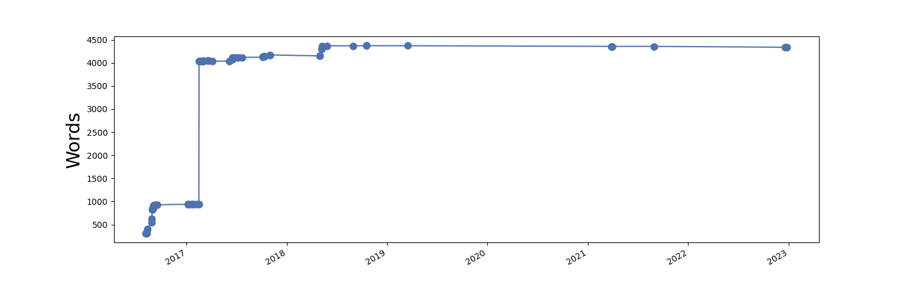

markdown-memo
===========================

This project is meant to make writing easier and more productive.

So you want to write a document.
Maybe you'll share it on the web.
Maybe you want a polished pdf. 
Maybe it's a blog, research paper, book draft, or just a set of notes.
You don't want to think about typesetting details.
You just want to throw your ideas in some plain text files and call `make`.

This package makes it very easy to compile notes taken in
[Markdown](http://daringfireball.net/projects/markdown/)
to valid xhtml or to a pdf via LaTeX.
It can be used to make simple webpages quickly,
for example, [rreece.github.io/sw/markdown-memo](http://rreece.github.io/sw/markdown-memo).

Author
----------------------------------

Ryan Reece <ryan.reece@cern.ch>     
Created: July 29, 2014

License
----------------------------------

Copyleft 2014-2016 Ryan Reece     
License: GPL <http://www.gnu.org/licenses/gpl.html>

Requirements
----------------------------------

-   LaTeX
-   pandoc
-   make

I've also had to install `pandoc-crossref`, and I think I had to install `pandoc-citeproc`.
In the case of [pandoc-crossref](https://github.com/lierdakil/pandoc-crossref), you simply
do this to install:

    cabal update
    cabal install pandoc-crossref

Features
----------------------------------

### html

-   [disqus comments](disqus.com)
-   mathjax LaTeX rendering
-   google analytics tracking
-   automatically generates an `index.md`

If you want to write your own `index.md`,
then put the same markdown in `index.txt`.

### pdf

-   LaTeX
-   fancyheader

### both

-   appendices
-   bibtex bibliographies
-   footnotes
-   multiple authors
-   word- and page-count plots (see below)

Getting started
----------------------------------

-   Clone/fork this package and possibly rename the `markdown-memo`
    directory as your project.
-   Put some `*.md` files in that directory.
-   In those files, just start writing the `h1` heading.
    There's no need for additional markup or html.
    Examples of [Markdown](http://daringfireball.net/projects/markdown/)
    syntax are

        Section 1
        =================================

        Sub-section 1
        ---------------------------------

        [Lorem ipsum](https://en.wikipedia.org/wiki/Lorem_ipsum)
        dolor sit amet, duo ut putant verear, nam ut brute utroque.
        Officiis qualisque conceptam te duo, eu vim soluta numquam, has ut aliquip
        accusamus. Probo aliquam pri id. Mutat singulis ad vis, eam euismod pertinax
        an, ea tale volumus vel. At porro soleat est. Debet facilis admodum an sed,
        at falli feugiat est.

        1.  one
        1.  two
        1.  three
    
        You can do latex in-line, $e^{i\pi} + 1 = 0$, like that.
        Or equations:

        \begin{equation}
            \int_{\partial\Omega} \omega = \int_{\Omega} \mathrm{d}\omega \,.
        \end{equation}
-   Edit the metadata in `meta.yaml`.
-   Call `make` to generate valid xhtml.
-   Call `make pdf` to generate a pdf document.
-   Call `make clean` to delete temporary LaTeX files.
-   Call `make realclean` to additionally delete the output html and pdf files.

I use an image of my email to hide it from text crawlers.
Please replace `img/my_email.png` with a screenshot of your
email address instead of mine,
or just remove the use of the image in `meta.yaml`.

Customize the files in `templates/` to adjust the format
of the output html and pdfs files to your needs.

If you want to put the html online, perhaps a solution for you,
because it's free and easy, would be to host the pages at github.
See: [pages.github.com](https://pages.github.com/).

Special files
----------------------------------

There are a few special files that help steer the execution of `markdown-memo`
or are otherwise exceptional.

Documentation:

-   `README.md` - this file.
-   `VERSIONS` - documents the chronology `markdown-memo` versions.  Feel free to delete or adapt this to your project.

Primary files edited by the user:

-   `meta.yaml` - the main metadata file controlling the project in many ways.
-   `*.md` - any other user-created markdown files, the mark-up of your document.

Optional files:

-   `index.[md,txt]` - The top-level, root file of your project. By default, if `index.txt` is missing,
    a table of contents is generated for `index.md`, otherwise (the user-written) `index.txt`
    is copied to be the `index.md`.
-   `bib_index.md` - Call `make bib_index.md` to generate this file. It is to help incoorporate citations
    into your document by being an automatically generated list of the references, with footnotes,
    created from the available bibliography files in `bibs/`.
-   `order.txt` - Optionally, the user can create this file, which should have a list of
    markdown files used in the document, one-per-line, in the order as to be used for the
    navigation buttons in the html template.  By default, building the html will generate this
    file if it doesn't already exist, with the markdown files listed in alphabetical order.
    If one names the markdown files something like `01-first-section.md`, `02-second-section.md`, etc.,
    then the order should be handled automatically.

Disqus integration
----------------------------------

You can choose to append a comments section at the end of your html.
Just register a user name and the site name with [disqus.com](disqus.com).
Then in the `meta.yaml`, set `disqus: true`, and set your `disqus_shortname`.

Word count
----------------------------------

Note that word-count and page-count plots are generated when you call make.
You might want to keep these around in the `README.md` for your document.

Wish list / TODOs
----------------------------------

-   ~~Automatically generate an index.md with a TOC.~~
-   ~~Find and replace the default figure environment to be `\begin{figure}[tph]` instead of `\begin{figure}[htbp]`.~~
-   ~~Add conditionals to the `Makefile` such that `templates/refs.md` is only added for documents that have references.~~
-   ~~Write a script to generate a md file with footnotes and citations defined given a bibliography (`make_bib_index.py`).~~ 
-   ~~Find and replace such that LaTeX figures use pdf figures while html uses raster png/jpg.~~
-   ~~Optionally make a TOC automatically in the html.~~
-   ~~Make links to previous and next sections (if they exist) in the navigation box in the html.~~
-   Finish the documentation in the `markdown-memo` example document.
-   Get tables to be normal `\begin{table}[bph]` instead of the `longtable` environment.

See the version history: [VERSIONS](VERSIONS)

See also
----------------------------------

-   [rreece.github.io/sw](http://rreece.github.io/sw/)
-   [rreece.github.io/sw/markdown-memo](http://rreece.github.io/sw/markdown-memo)
-   [kprussing.github.io/writing-with-markdown](http://kprussing.github.io/writing-with-markdown/)
-   [programminghistorian.org/lessons/sustainable-authorship-in-plain-text-using-pandoc-and-markdown](http://programminghistorian.org/lessons/sustainable-authorship-in-plain-text-using-pandoc-and-markdown)
-   [pandoc.org/README.html](http://pandoc.org/README.html)
-   [commonmark.org](http://commonmark.org/)
-   [scholarlymarkdown.com](http://scholarlymarkdown.com/)
-   [github.com/lierdakil/pandoc-crossref](https://github.com/lierdakil/pandoc-crossref)

