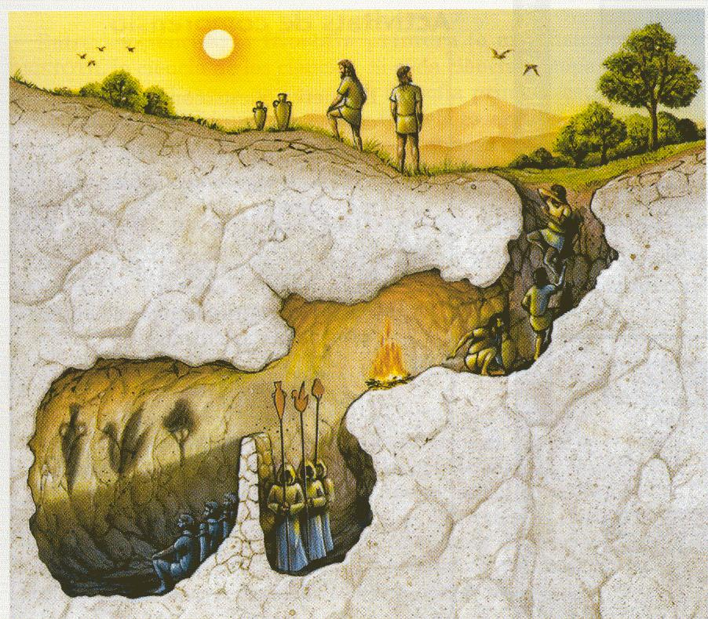

---
title:  'This is the title: it contains a colon'
author: 'Ryan Reece'
affiliation: 'University of California, Sant Cruz'
date: 'August 1, 2015'
abstract: |
  This is the abstract.

  It consists of two paragraphs.
...

Scientific realism: what's the big deal?
===============================================================================

Preface
-------------------------------------------------------------------------------

Last week, I had such an intellectually engaging time at the
[3rd International Summer School in Philosophy of Physics](https://sites.google.com/site/isspp2015/).
The topic of the summer school was "The ontology of physics."
Most of the attendees were philosophy Ph.D. students studying
philosophy of science, and there were
some theoretical physicists focussing on the foundations of quantum
mechanics. I was the only experimental physicist there, and I gave a
talk giving a big-picture summary of the ATLAS experiment. While
studying philosophy independently has been a passion of mine for a long
time, it was such a unique experience for me to be among that crowd, as
it was my first philosophy summer school or conference. I have so many
ideas spinning in my head. I hope I can spend more time fleshing out
what the school got me thinking about in this blog, but first I want to
discuss something more basic to the entire effort: what is ontology?

Ontology is the study of what exists, what is the nature of being, 
and what it means "to be". It is a sub-branch of the larger branch of
philosophy called metaphysics, which deals some of the most fundamental
questions in philosophy like---What is the nature of reality?
What exists in the world? What is it like? What is real?
What is the nature of space and time? etc. 
Ontology is the focus on---What are the things that exist in the world,
its furnishings, ingredients, or parts?
What kinds of things are they?
Are they waves, or particles, or something else?

TODO: I've been trying to get this blog going.
A lot of what I want to discuss is the philosophy of science.
It's interesting how polarizing between realist and
anti-realist both scientists and the general public can be.

What is real?
-------------------------------------------------------------------------------

People have various reactions when you ask them---what is real? Can we
claim to know anything about reality? Is it a goal of science to
describe reality? Does science make any progress at describing reality?

*Realism*[^Realism] is one of the deepest and oldest issues in
philosophy. Very roughly, to be a realist about something is to support
the claim that the thing in question exists in the world independent of
our conceptualizations of it (*i.e.* independent of one's beliefs,
linguistic practices, conceptual schemes, etc.). Closely related to
realism is a notion of *objectivity* that real things should have. When
one says something is real, they claim that it exists objectively in a
way independent of any person's particular subjective experience. One
can be realist or anti-realist about many things, often with differing
positions depending on the subject matter, *e.g.*, the external world
generally, the scientific image of the world, ethics, aesthetics, etc.
In what follows, we will focus on the debate over scientific realism:
whether science makes progress at revealing truths about reality. I
cannot pretend to be able to summarize or give a final word to the issue
here, but I would like to give a coarse classification of the possible
positions, walk through some the basic arguments, and end with in
unembellished case in support of scientific realism.

Most would agree that
science is a human enterprise that chronicles observed phenomena,
builds models that attempt describe and explain the nature of that
phenomena, and performs some empirical tests to evaluate the success of
those models. Not everyone agrees on how the success of science should
be interpreted.
According to the ***Very Coarse Classification of views of science* (VCC)**
that I propose here, one can loosely group the
possible positions one can take in response to the claim that science
makes progress at revealing (at least approximate) truth about reality.
Let's get them on the table, ordered from more undoubting to more
skeptical:

1.  Na&iuml;ve realists
2.  Scientific realists
3.  "Scientifically sympathetic" anti-realists (*e.g.* positivists and constructive empiricists)
4.  Relativists (*i.e.* anti-realists that are skeptical of objectivity).

*Na&iuml;ve realism* (or *direct realism*) is to take the common sense
appearance of the world as real. This is how most if not all of us grow
up seeing the external world, granted as real. It is usually not until
we've thought about it long enough or been exposed to some basic
philosophy that we learn to recognize that we might call the mountains
on the horizon real and existing before (and after) we came to see them,
but not in the same way that we might claim a legal contract is real or
not, or fiat money, or a song, or Newton's law of gravitation. If
considering how the metaphysical grounding or sense of existence could
be different for those things is a new or strange consideration for you,
Jim Baggott's *A Beginners Guide to Reality*[^Baggott] is a gentle
but engaging introduction to the debates surrounding the levels of
realism.

.](img/1024px-the_scientific_universe.png "=300x")

If we agree we'd like to know what's real,
arguably the most compelling and exhaustive body of knowledge about the
world that humans have acquired is through the many fields of study
practiced in the sciences (broadly understood, including physical
sciences like physics and chemistry as well as social sciences including
history and sociology, among others[^Feynman]).
Especially in its rapid progress in the last three hundred or more years,
science has increasingly erected explanations where there were previously
speculations and myths concerning the nature of matter, the movements
of astronomical bodies, the complexity and functions of life, and many
other areas of investigation. Along with the reductive understanding of
successful scientific theories also comes technological capability and
engineering, the power of which is so ubiquitous and clear today that it
is not hard to see why one might think there is something *real* in
the claims affirmed by science.

Chakravartty[^Chakravartty] defines *scientific realism* as

> Scientific realism is the view that our best scientific theories give
> approximately true descriptions of both observable and unobservable
> aspects of a mind-independent world.

The explanatory power of science makes scientific realism appealing.
If it were true, one could argue that scientific realism has profound
epistemological, metaphysical, ethical, and political implications insofar
as it could settle debates about the *real states of affairs in the world*.
But before we act so sure of having such a firm grip on reality, let us
survey many of the reasons one might be skeptical of the success of
science at revealing reality. The remaining two classes of views in my
VCC are anti-realist rebuttals to scientific realism, one class of views
being more sympathetic with notions of progress and instrumental
efficacy in science but ultimately skeptical of metaphysical claims
about reality, the other class more radically skeptical of objective
notions of truth in general.

Skepticism
-------------------------------------------------------------------------------

There are several reasons we should be skeptical. I'm fond of supporting
the idea that skepticism should be the driving force in curbing our
philosophical claims; there are just too many bad ideas, so many more
than good ideas, dare we say the right ones.

In the following we briefly discuss a few thought experiments,
hypothetical situations to consider,
that illustrate basic challenges to our certainty.
Even if these situations seem far-fetched,
I hope you will consider how exploring them highlights fundamental challenges
to our knowledge claims that any philosophy of epistemology,
and consequently metaphysics, will have to address,
challenges to everything we have been taught, conceived, or sensed.

. Public Domain.
    ](img/descartes_mind_and_body.png)

Ren&eacute; Descartes, called the "father of modern philosophy," is remembered as
being exceptional for his time for his systematic approach to doubt and skepticism.
In his book *Meditations on First Philosophy*[^Descartes] (published in 1641),
he asks us to ponder, as the subtitle of the first meditation reads, 
"Of those things that may be called into doubt." Rebelling against the poorly
premised scholastic bullshit philosophy that had proliferated through the
Medieval period since Aristotle, Descartes ambitioned to put philosophy on
a more certain foundation on which one could rationally build.
Descartes acknowledges that everything we have been taught by authorities since
childhood could be mistaken.  He also points out that all of our sensory experiences,
including the sensations of having this human body and being in this place,
could be mistaken; we could be dreaming or hallucinating.

>   Let us then suppose that we are dreaming, and that these particular
>   things (that we have our eyes open, are moving our head, stretching
>   out our hands) are not true; and that perhaps we do not even have hands
>   or the rest of a body like what we see.

Pressing further reasons to doubt our experiences, Descartes devises a thought
experiment where there exists an "evil spirit," some translations say "evil demon,"
that is constantly feeding our senses false impressions about the world.

>   I will therefore suppose that ... some evil spirit, supremely powerful
>   and cunning, has devoted all his efforts to deceiving me. I will think
>   that the sky, the air, the earth, colors, shapes, sounds, and all
>   external things are no different from the illusions of our dreams,
>   and that they are traps he has laid for my credulity; I will consider
>   myself as having no hands, no eyes, no flesh, no blood, and no senses,
>   but yet as falsely believing that I have all these; I will obstinately
>   cling to these thoughts, and in this way, if indeed it is not in my
>   power to discover any truth, yet certainly to the best of my ability
>   and determination I will take care not to give my assent to anything
>   false, or to allow this deceiver, however powerful and cunning he may be,
>   to impose upon me in any way.

After giving us reasons to doubt virtually everything we experience,
Descartes tries to reassure us that we can at least be certain that
we exist because we have thoughts, and that this is one fact on which we can stand firm.
Immortalized in Latin in his famous quotation,
he says "Cogito ergo sum," or "I think, therefore, I am."

It is questionable how well Descartes stayed true to the pledge to rational
skepticism. In the later parts of the *Meditations* he gives a version of
what is now called the "ontological proof for the existence of God," and goes on
to argue that because God is good, we have reason to think that we are not
being deceived, a discussion of which would take us too far from our target
of discussing scientific realism.

The more impactful insight Descartes shows in the *Meditations* is to point
out the fundamental divide between the *appearances of things* and the real
*things in the world* (whatever they are), a distinction Immanuel Kant[^Kant]
would later label as the difference between *phenomena*, our sensory observations,
and what he called "*noumena*," or things in themselves, *i.e.* what things really are,
which is arguably the target of study of ontology.
The thought experiment of Descartes' demon has been rebooted many times
in more contemporary terms, for example, in Putnam's "Brain in a vat"[^Putnam] scenario
we are asked to consider the possibility that our brains are in fact
disemboddied, not connected to a real human body, but are instead "in a vat"
with every neural channel and important connection to the brain given artificial
signals with sufficient detail and similarity to what the signals would be
in a brain connected to a real body that it produces a high-fidelity simulated experience.
This kind of scenario has been illustrated in several science fiction films
and other popular media[^Wachowski]
including the films *<a href="https://en.wikipedia.org/wiki/The_Matrix">The Matrix</a>*
and *<a href="https://en.wikipedia.org/wiki/The_Thirteenth_Floor">The Thirteenth Floor</a>*.

It is interesting to note that
Nick Bostrom further argues[^Bostrom] that if we take on the premises that
simulated conscious experiences can exist not only for disemboddied brains,
but for brains which themselves are simulated and only instantiated in the software
of a simulation (*i.e.* if functionalism[^Functionalism] is sufficient for consciousness),
and if the growth of technology makes feasible high-fidelity simulations of possible
histories of the cosmos, including ones where conscious observers evolve,
so-called "ancestor simulations," then according to Bostrom's
"[simulation argument](http://www.simulation-argument.com/simulation.html),"
at least one of the following is true:

1.  Civilizations very likely go extinct before acquiring the technology to do significant numbers of ancestor simulations.
2.  Advanced civilizations that do have such technological capability choose, for whatever reason, not to generate significant numbers of ancestor simulations.
3.  There are so many more simulated consciousnesses than not simulated, we are almost certainly in a simulation.

Bostrom does not necessarily conclude from this that it is likely that we are in a simulation
(the third possibility), but contends that we should be wary that maybe extinction
is much more likely to happen before acquiring such technology,
or we should be able to explain better
why advanced civilizations would lose interest or choose not to make such simulations.
A further analysis of these possibilities is beyond my current scope.

***Below here is under construction***

As a final example argument for doubting our access to reality along the lines
of Descartes' demon, note that similar ideas can be found in 
the "Allegory of the cave" in Plato's *Republic*[^Plato].

-   TODO: describe the scene.

>   Then the prisoners would in every way believe that the truth is nothing
>   other than the shadows of those artifacts.

-   Plato is warning us that our view on the world may be narrow.
-   Learning the truth may require us to break away from past assumptions
    and what our intuitions find comfortable.
-   How relevant it is today when we have so many simulated experiences
    through a screen.
-   Parmenides[^Parmenides]
-   Kaku, lilly pads, extra dimensions, Flatland
-   Reality could be radically different from how we experience it.

I mention these examples to show that we are still wrestling with Plato's cave
and Descartes' demon.
Any account of how certain we are about what there is in the world must address
or note caveats for these doubts.
They show that our sensory access to reality is indirect at best, and at worst,
it could be fabricated and completely false.

Rationalism vs empiricism
-------------------------------------------------------------------------------

-   Much of the history of philosophy has been shaped as responses to this kind of skepticism. Where can we go from here?
-   Rationalism: Ren&eacute; Descartes (1596-1650), Baruch Spinoza (1632-1677), Gottfried Wilhelm Leibniz (1646-1716)
-   Empiricism: John Locke (1632-1704), George Berkeley (1685-1753), David Hume (1711-1776)
-   Hume still echos the loudest
-   Many philosophers in that Early Modern Period had threads of Idealism (wikipedia: reality itself is incorporeal or experiential at its core). *e.g.* George Berkeley, Kant, Friedrich Hegel, Immanuel Kant (1724-1804)
-   Challenges to metaphysical realism - Khlentzos[^Khlentzos].
-   Contemporary skepticism[^Pritchard]
-   Hume and the Problem of Induction[^Hume].
-   The sun will rise tomorrow. The uniformity of nature.
-   "Here is one hand"[^Moore] - Moore.
-   Science and induction work in practice; nod to pragmatism.
-   What is science?
-   Galileo Galilei
-   The Newtonian revolution as a maturing of the scientific method.
-   Maybe note Weinberg's book
-   Quote Al hazen

Positivism
-------------------------------------------------------------------------------

Positivism is a philosophy of science and epistemology that roughly
defends a qualified empiricism, that the scientific method is the only
route to knowledge, and that all statements that cannot be empirically
verified are meaningless. Positivism is strongly eliminative about
metaphysics and claims that many metaphysical questions and positions
are not open or false, but meaningless because of their lack of
attachment to empirically demonstrable things or effects. This means
that positivism is generally seen to imply anti-realist views of science
and mathematics, preferring as Carnap says in Empiricism, Semantics, and
Ontology: 

>   As far as possible they [empiricists] try to avoid any
>   reference to abstract entities and to restrict themselves to what is
>   sometimes called a nominalistic language, i.e., one not containing
>   such references.

Positivists have instrumentalist (anti-realist) views about
the models science produces, given that they are constructed from
abstractions and involve the epistemological limitations of induction
and theory change.

As a qualified sort of empiricism that supports the
primacy of the scientific method, positivism is sometimes equated with
scientism (often derogatorily, as you say) if one takes it to claim that
science is the only way to attain knowledge.

In a more general sense, positivism is aligned with naturalism,
the meta-philosophy that roughly says that science should inform
and bootstrap our philosophical claims.
Naturalists, having a more broadly aligned and various support for
science, may not have such exclusive views of epistemology or such
eliminative views of metaphysics. Many naturalists are instead realists
about science, math, and/or ethics, for example following a version of
structural realism about the discoveries from science, capturing and
constraining real structures in nature.

If your proposition does not
imply a claim that is empirically verifiable, then you just don't know
what you are talking about, and what you said is meaningless.

-   The success of the scientific revolution
-   Verificationism
-   Auguste Comte, positivism
-   Gottlob Frege, Bertrand Russell, Afred North Whitehead, George
    Edward Moore. Ludwig Wittgenstein *Principia Mathematica*.
-   Logical postivism, Vienna circle[^Vienna], Moritz Schlick,
    Rudolf Carnap, Kurt Gödel, and others.
-   Logical empiricism - Creathe[^Creathe].
-   Positivism, instrumentalism, nominalism[^Bueno].
-   Carnap ESO[^Carnap].
-   I'm still largely inspired by positivism.
-   On of my favorite questions for philosophers, especially those that
    know some science, is "Why do people say positivism is dead?"[^LogicalPositivism]
-   In many ways, with the culture wars, I like to see it as the
    positivists won. The influence of positivism is clear and broad in
    many movements, changing what our vision having good evidence, doing
    of good scholarship, and the structure of academic pursuits in
    general: positivists.org[^Positivists].
-   In my opinion, the so-called death of positivism is attributed
    separately to at least two causes: (1) Too anti-realist to have any
    metaphysics, but note naturalism is active and scientific. (2) Many
    are just critical of scientism.
-   Positivism leaves us in the somewhat comical and tragic position of
    having those who are arguably most qualified to claim the states of affairs
    in reality being philosophically against making any kind of claim about what is real
-   Scientists stuck in positivism: Hawking or given up on philosophy:
    Krauss. Pigliucci[^Pigliucci].

Post-postivism and naturalism
-------------------------------------------------------------------------------

Perceived failures of positivism:

1.  Theory change in general relativity and quantum mechanics.
2.  Incompleteness and limitations in axiomatization and foundations of mathematics.

-   Confirmation and induction[^Huber]
-   Underdetermination - Stanford[^Underdetermination].
-   *The Logic of Scientific Discovery* - Popper[^Popper].
-   *The demarcation problem* and *falsifiability*.
-   *The Structure of Scientific Revolutions* - Kuhn[^Kuhn].
-   Relativism, the culture wars, the science wars
-   *Fear of Knowledge* by Boghossian[^Boghossian].
-   Epicycles
-   Science as error-correcting filters - *Every Thing Must Go*[^Ladyman].
-   Naturalism - Jacobs[^Naturalism].
-   Ionian enlightenment[^Ionian].

Quine[^QuineNaturalKinds], philosophy and science are continuous:

>   At this point let me say that I shall not be impressed by protests that I am
>   using inductive generalizations, Darwin's and others, to justify induction,
>   and thus reasoning in a circle. The reason I shall not be impressed by this
>   is that my position is a naturalistic one;
>   I see philosophy not as an *a priori* propaedeutic or groundwork for science,
>   but as continuous with science. I see philosophy and science as in the same
>   boat---a boat which, to revert to Neurath's figure as I so often do,
>   we can rebuild only at sea while staying afloat in it. There is no external
>   vantage point, no first philosophy. All scientific findings, all scientific
>   conjectures that are at present plausible, are therefore in my view as welcome
>   for use in philosophy as elsewhere.

.](img/quine-naturalism.png)

Quine on naturalism[^QuineTheoriesThings]:

>   ... I also expressed, at the beginning, my unswerving belief in external
>   things---people, nerve endings, sticks, stones. This I reaffirm. I
>   believe also, if less affirmly, in atoms and electrons, and in
>   classes. Now how is all this robust realism to be reconciled with the
>   barren scene that I have just been depicting? **The answer is
>   naturalism: the recognition that it is within science itself, and not
>   some prior philosophy, that reality is properly to be identified and described.**

[bold added]

Manifest image and scientific image - Sellars[^Sellars].

>   The aim of philosophy, abstractly formulated, is to understand how
>   things in the broadest possible sense of the term hang together in the
>   broadest possible sense of the term. Under 'things in the broadest
>   possible sense' I include such radically different items as not only
>   'cabbages and kings', but numbers and duties, possibilities and finger
>   snaps, aesthetic experience and death. To achieve success in philosophy
>   would be, to use a contemporary turn of phrase, to 'know one's way
>   around' with respect to all these things...

Sellars:

>   Philosophy in an important sense has no special subject-matter which
>   stands to it as other subject-matters stand to other special disciplines.
>   If philosophers did have such a special subject-matter, they could turn it
>   over to a new group of specialists as they have turned other special
>   subject-matters to non-philosophers over the past 2500 years, first with
>   mathematics, more recently psychology and sociology, and, currently,
>   certain aspects of theoretical linguistics. What is characteristic of
>   philosophy is not a special subject-matter, but the aim of knowing one's
>   way around with respect to the subject-matters of all the special disciplines.

Constructive empiricism vs structural realism
-------------------------------------------------------------------------------

-   There is no need to be so essentialist about ontology and knowledge.
    In my opinion, the more interesting part of the scientific realism debate
    are the positions in the space between VCC positions 2 and 3.
    They admit that science is a pragmatic enterprise with
    layers of conceptualization that serve as more efficient descriptions
    in different contexts.
-   Constructive empiricism - Monton[^Monton].
-   van Fraassen[^vanFraassen].
-   QED and precision and structure[^QED].  (TODO: maybe mention this earlier)
-   Abduction - Douven[^Abduction].
-   When is it appropriate to use Occam's razor and when is it not?
-   Structural realism - Ladyman[^StructuralRealism].
-   Worrall on Structural Realism[^Worrall].
-   Frigg, R. and I. Votsis[^Frigg].
-   S. French, R. Frigg, J. Ladyman, E. Landry, S. Psillos, D.P. Rickles, S. Saunders, I. Votsis, D. Wallace
-   H. Poincar&eacute; and ESR,
-   *Writing the Book of the World* by Sider[^Sider] (also in defense of structure).
-   Weinberg Effective Field Theory and structure[^Weinberg].
-   Re-address Bostrom's simulation on science discovering structure.
    If I get hit by a car in the simulation, I want to go to a simulated hospital,
    and I hope my surgen washed his simulated hands and spent many simulated hours
    at simualted medical school.
-   Tegmark: The Mathematical Universe Hypothesis,
    neopythagoreanism[^Tegmark].
-   Natural kinds - Bird and Tobin[^NaturalKinds].
-   Come back to naturalism and *Scientific Metaphysics*[^ScientificMetaphysics].

Recap: what is the meaning of "is"
-------------------------------------------------------------------------------

-   Is the argument just semantics or moot?
-   Clintonian distortion of what we naturally mean.

>   It depends on what the meaning of the word 'is' is.

--- Bill Clinton (during the independent counsel testimony concerning the Lewinsky scandal)[^Clintonian].

It's important to emphasize that we have good reasons to think there is a
world external to us, and we can know a thing or two about it.
Our knowledge may be structural, or contextual, or caveated in interesting ways
worth discussing, but it is arguable that a kernel of objectivity will
remain in our well-tested claims supported by good science.
The knowledge science brings is certainly preliminary, and open to revision
in the light of more information, but
good science makes progress at revealing at least approximate truth
about reality. Let's call it real.

Personally, I'm sympathetic with some version of structural realism.

-   Recent National Geographic article: "Why Do Many Reasonable People Doubt Science?"[^Achenbach]
-   Goldstein[^Goldstein]

"Scientific realism is just faith." Ask yourself without Clintonian distortion:

-   Do airplanes (really) fly?
-   Would a flight on an airplane from New York City to Paris (really) take you from the United States and put you in the capital city of France?
-   Do pregnancy tests (really) reveal if you are pregnant?
-   Would bad news in the report from a medical test (really) have implications for (the metaphysical state of affairs of) your life and health (in reality)?
-   Does Europa, one of planet Jupiter's moons, (really) have water?
-   Do vaccines (really) prevent diseases?
-   Is climate change (really) driven by human activity?

Recap:

1.  There is an external world.
2.  If we are careful enough, we can collect robust information about
    phenomena in the world.
3.  TODO: syllogism

-   If you are going to defend an anti-realist line of reasoning,
    that's fine and I find it fascinating, but let's be clear about what
    caveats and contrivances we are accepting if we go down a line of
    reasoning.
-   If you are going to doubt the reality of the claims of our best scientific theories,
    which conspiracy are you going to plead.

Other TODOs:

-   Political implications. "Philosophy Returns to the Real World."[^Sartwell]
-   Views on *laws of nature*.
-   [Cormac McCarthy on scientific
    realism](https://www.youtube.com/watch?v=6TlqVVuxqEg)
-   [Daniel Dennett scolds Alex Rosenberg for being too *essentialist* about reality](https://www.youtube.com/watch?v=qeyBqxY3MsQ&feature=youtu.be&list=PLrxfgDEc2NxYQuZ5T6CSdS8uafdh0kmDL&t=5193) - a plea for some version of pragmatism.
-   "The strategic task of making the world clear to others."
-   Add the "philosophy of science" figure from philosophy-in-figures.
-   Quote Maudlin start of *The Metaphysics Within Physics*.
-   Adam Ford has put together some short interviews with philosopher
    John Wilkins that are great introductions to topics in the
    philosophy of science:
    -   [Philosophy of science - an introduction](https://www.youtube.com/watch?v=LUm_7lo_eXA)
    -   [The demarcation problem](https://www.youtube.com/watch?v=ZwbkRyopBEQ)
    -   [Scientific realism](https://www.youtube.com/watch?v=l8MMPkA9LgI)

[^Realism]: Miller, A. (2014). "[Realism](http://plato.stanford.edu/entries/realism/)." Stanford Encyclopedia of Philosophy.   
    "[Philosophical realism](https://en.wikipedia.org/wiki/Philosophical_realism)." Wikipedia.

[^Baggott]: Baggott, J. (2005). *[A Beginners Guide to Reality](http://www.amazon.com/Beginners-Guide-Reality-Adventures-Wonderland/dp/1605980641)*. Penguin Group.

[^Feynman]: Feynman, R.P. (1963). "[The Relation of Physics to Other Sciences](http://www.feynmanlectures.caltech.edu/I_03.html)." *The Feynman Lectures on Physics, Volume I*. California Institute of Technology.

[^Chakravartty]: Chakravartty, A. (2007). *[A Metaphysics for Scientific Realism](http://www.amazon.com/Metaphysics-Scientific-Realism-Knowing-Unobservable/dp/0521130093/)*. Cambridge: Cambridge University Press.   
    Chakravartty, A. (2011). "[Scientific Realism](http://plato.stanford.edu/entries/scientific-realism/)." Stanford Encyclopedia of Philosophy.   
    "[Scientific realism](https://en.wikipedia.org/wiki/Scientific_realism)." Wikipedia.
[^Descartes]: Descartes, R. (1641). *Meditations on First Philosophy*.   
    Hatfield, G. (2008). "[Ren&eacute; Descartes](http://plato.stanford.edu/entries/descartes/)." Stanford Encyclopedia of Philosophy.   
    Klein, P. (2015). "[Skepticism](http://plato.stanford.edu/entries/skepticism/)." Stanford Encyclopedia of Philosophy.   
    "[Meditations on First Philosophy](https://en.wikipedia.org/wiki/Meditations_on_First_Philosophy)." Wikipedia.

[^Kant]: Kant, I. (1781). *Critique of Pure Reason*.   
    "[Noumenon](https://en.wikipedia.org/wiki/Noumenon)." Wikipedia.

[^Putnam]: Putnam, H. (1981). *Reason, Truth, and History*. Cambridge: Cambridge University Press.   
    Hickey, L.P. (2005). "[The Brain in a Vat Argument](http://www.iep.utm.edu/brainvat/)." Internet Encyclopedia of Philosophy.   
    "[Brain in a vat](https://en.wikipedia.org/wiki/Brain_in_a_vat)." Wikipedia.

[^Wachowski]: Wachowski, A. and L. Wachowski (directors) (1999). *[The Matrix](https://en.wikipedia.org/wiki/The_Matrix)* (a film).   
    Rusnak, J. (director) (1999). *[The Thirteenth Floor](https://en.wikipedia.org/wiki/The_Thirteenth_Floor)* (a film).

[^Bostrom]: Bostrom, N. (2003). "[Are You Living in a Computer Simulation?](http://www.simulation-argument.com/simulation.html)." *Philosophical Quarterly*. Vol. 53, No. 211, pp. 243-255.   
    Bostrom, N. and M. Kulczycki (2011). "[A Patch for the Simulation Argument](http://www.simulation-argument.com/patch.pdf)." *Analysis*. Vol. 71, No.1, pp. 54-61.   
    Bostrom, N. (2011). "[The Simulation Argument FAQ](http://www.simulation-argument.com/faq.html)."

[^Functionalism]: Levin, J. (2013). "[Functionalism](http://plato.stanford.edu/entries/functionalism/)." Stanford Encyclopedia of Philosophy.   
    Polger, T.W. (20XX). "[Functionalism](http://www.iep.utm.edu/functism/)." Internet Encyclopedia of Philosophy.   
    "[Functionalism (philosophy of mind)](https://en.wikipedia.org/wiki/Functionalism_(philosophy_of_mind))." Wikipedia.

[^Plato]: Plato. Rouse, W.H.D., ed. *The Republic Book VII*. Penguin Group. pp. 365-401. (Originally written ca. 360 BCE). [[A translation is available online here](http://classics.mit.edu/Plato/republic.8.vii.html)].   
    "[Allegory of the Cave](https://en.wikipedia.org/wiki/Allegory_of_the_Cave)." Wikipedia.

[^Parmenides]: Palmer, J. (2012). "[Parmenides](http://plato.stanford.edu/entries/parmenides/)." Stanford Encyclopedia of Philosophy.   
    "[Parmenides](https://en.wikipedia.org/wiki/Parmenides)." Wikipedia.

[^Khlentzos]: Khlentzos, D. (2011). "[Challenges to Metaphysical Realism](http://plato.stanford.edu/entries/realism-sem-challenge/)." Stanford Encyclopedia of Philosophy.

[^Pritchard]: Pritchard, D. (20XX). "[Contemporary Skepticism](http://www.iep.utm.edu/skepcont/)." Internet Encyclopedia of Philosophy.

[^Moore]: Preston, A. (2005). "[George Edward Moore](http://www.iep.utm.edu/moore/)." Internet Encyclopedia of Philosophy.

[^Hume]: Vickers, J. (2014). "[The Problem of Induction](http://plato.stanford.edu/entries/induction-problem/)." Stanford Encyclopedia of Philosophy.   
    "[Problem of induction](https://en.wikipedia.org/wiki/Problem_of_induction)." Wikipedia.

[^Vienna]: Murzi, M. (2004). "[Vienna Circle](http://www.iep.utm.edu/viennacr/)." Internet Encyclopedia of Philosophy.

[^Creathe]: Creathe, R. (2011). "[Logical Empiricism](http://plato.stanford.edu/entries/logical-empiricism/)." Stanford Encyclopedia of Philosophy.

[^Bueno]: Bueno, O. (2013). "[Nominalism in the Philosophy of Mathematics](http://plato.stanford.edu/entries/nominalism-mathematics/)." Stanford Encyclopedia of Philosophy.

[^Carnap]: Carnap, R. (1950). "Empiricism, Semantics, and Ontology." *Revue Internationale de Philosophie 4*. pp. 20-40.

[^LogicalPositivism]: "[Logical positivism](https://en.wikipedia.org/wiki/Logical_positivism)." Wikipedia.

[^Positivists]: [positivists.org/blog/movements](http://positivists.org/blog/movements)

[^Pigliucci]: Pigliucci, M. (2012). "[Lawrence Krauss: another physicist with an anti-philosophy complex](http://rationallyspeaking.blogspot.co.uk/2012/04/lawrence-krauss-another-physicist-with.html)."

[^Naturalism]: Jacobs, J. (2002). "[Naturalism](http://www.iep.utm.edu/naturali/)." Internet Encyclopedia of Philosophy.

[^Ionian]: Prado, I. (2006). "[Ionian Enchantment: A Brief History of Scientific Naturalism](http://www.naturalism.org/history.htm)."

[^QuineNaturalKinds]: Quine, W.V.O. (1969). "Natural Kinds." *Ontological Relativity and Other Essays*. Ch. 5. New York: Columbia University Press.

[^QuineTheoriesThings]: Quine, W.V.O. (1981). *Theories and Things*. Harvard University Press.

[^Sellars]: Sellars, W. (1963). "Philosophy and the Scientific Image of Man." *Science, Perception, and Reality*. Atascadero, CA: Ridgeview Publishing Co.

[^Huber]: Huber, F. (2007). "[Confirmation and Induction](http://www.iep.utm.edu/conf-ind/)." Internet Encyclopedia of Philosophy.

[^Popper]: Popper, K. (1959). *The Logic of Scientific Discovery*. Hutchinson & Co. (Originally published in German as *Logik der Forschung* in 1934).

[^Kuhn]: Kuhn, T.S. (1962). *The Structure of Scientific Revolutions*. Chicago: University of Chicago Press.

[^Boghossian]: Boghossian, P. (2006). *Fear of Knowledge*. Oxford: Oxford University Press.

[^Ladyman]: Ladyman, J., D. Ross, D. Spurrett, and J. Collier (2007). *Every Thing Must Go: Metaphysics Naturalised*. Oxford: Oxford University Press.

[^Monton]: Monton, B. (2012). "[Constructive Empiricism](http://plato.stanford.edu/entries/constructive-empiricism/)." Stanford Encyclopedia of Philosophy.

[^vanFraassen]: van Fraassen, B. (1980). *The Scientific Image*. Oxford: Oxford University Press.

[^Underdetermination]: Stanford, K. (2013). "[Underdetermination of Scientific Theory](http://plato.stanford.edu/entries/scientific-underdetermination/)." Stanford Encyclopedia of Philosophy.

[^Abduction]: Douven, I. (2011). "[Abduction](http://plato.stanford.edu/entries/abduction/)." Stanford Encyclopedia of Philosophy.

[^QED]: TODO: QED

[^StructuralRealism]: Ladyman, J. (2014). "[Structural Realism](http://plato.stanford.edu/entries/structural-realism/)." Stanford Encyclopedia of Philosophy.

[^Worrall]: Worrall, J. (1989). "Structural realism: The best of both worlds?" *Dialectica 43*. pp. 99-124.

[^Frigg]: Frigg, R. and I. Votsis (2011). "Everything you always wanted to know about structural realism but were afraid to ask." *Euro Jnl Phil Sci*.

[^Sider]: Sider, T. (2011). *Writing the Book of the World*. Oxford: Oxford University Press.

[^Weinberg]: Weinberg, S. (1997). "What is Quantum Field Theory, and What Did We Think It Is?" [[arxiv:hep-th/9702027](http://arxiv.org/abs/hep-th/9702027)].

[^Tegmark]: Tegmark, M. (2007). "The Mathematical Universe." *Foundations of Physics 38*. pp. 101-150. [[arxiv:0704.0646](http://arxiv.org/abs/0704.0646)].   
    Tegmark, M. (2014). *[Our Mathematical Universe](http://www.amazon.com/Our-Mathematical-Universe-Ultimate-Reality-ebook/dp/B00DXKJ2DA)*. Knopf.

[^NaturalKinds]: Bird, A. and E. Tobin (2015). "[Natural Kinds](http://plato.stanford.edu/entries/natural-kinds/)." Stanford Encyclopedia of Philosophy.

[^ScientificMetaphysics]: Ross, D., J. Ladyman, and H. Kincaid (2013). *[Scientific Metaphysics](http://www.amazon.com/Scientific-Metaphysics-Don-Ross/dp/0198744102/)*. Oxford: Oxford University Press. (You can download the introduction for free [here](https://www.academia.edu/6778507/Introduction_Pursuing_a_Naturalist_Metaphysics_1)).

[^Clintonian]: Noah, T. (1998). "[Bill Clinton and the Meaning of 'is'](http://www.slate.com/articles/news_and_politics/chatterbox/1998/09/bill_clinton_and_the_meaning_of_is.html)." *Slate Magazine*. September 13, 1998.   
    "[Clintonian](https://en.wikipedia.org/wiki/Clintonian)." Wikipedia.   
    "[Lewinsky scandal](https://en.wikipedia.org/wiki/Lewinsky_scandal)." Wikipedia.

[^Achenbach]: Achenbach, J. (2015). "[Why Do Many Reasonable People Doubt Science](http://ngm.nationalgeographic.com/2015/03/science-doubters/achenbach-text)." *National Geographic*. March 2015.

[^Goldstein]: Goldstein, R. (2014). "[Science is our best answer, but it takes a philosophical argument to prove that](http://www.theguardian.com/books/2014/oct/19/rebecca-newberger-goldstein-interview-science-philosophy-plato-googleplex)." *The Guardian*. October 19, 2014.

[^Sartwell]: Sartwell, C. (2015). "[Philosophy Returns to the Real World](http://mobile.nytimes.com/blogs/opinionator/2015/04/13/philosophy-returns-to-the-real-world/)." *New York Times*. April 13, 2015.

